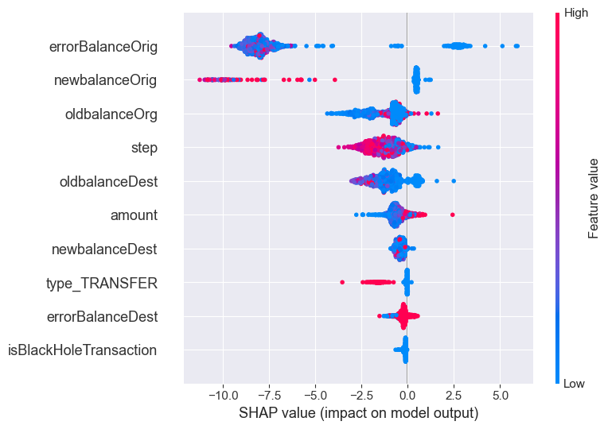
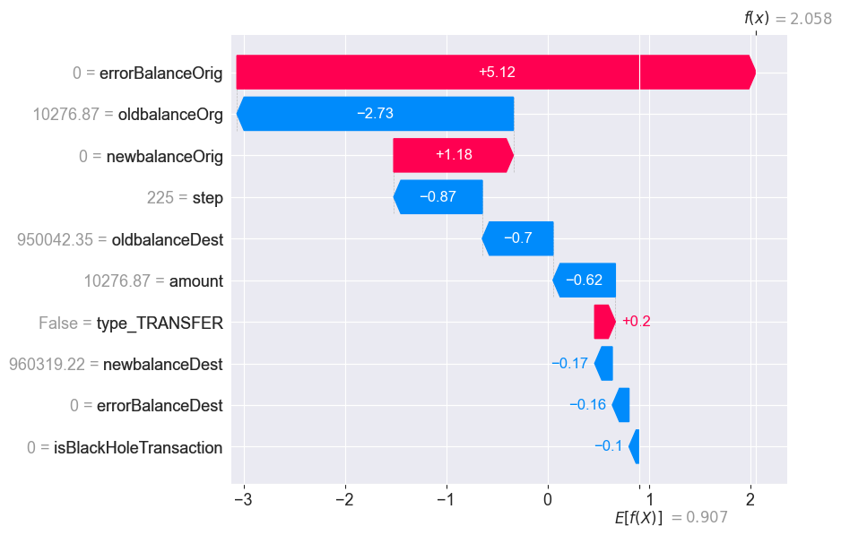

# End-to-End Fraud Detection API: A Hybrid Approach

This project demonstrates a complete, production-ready pipeline for detecting fraudulent financial transactions. It evolves from a baseline machine learning model to a sophisticated, real-time hybrid system that combines the nuanced power of XGBoost with the certainty of rule-based logic.

The final product is served as a high-performance, asynchronous web API using FastAPI, complete with data validation and interactive documentation.

## 🚀 Live Demo

This project is not just a script; it's a running service. Once you run the API locally, you can access the live, interactive documentation generated by FastAPI.

URL: `http://127.0.0.1:8000/docs`

From this page, you can send test transactions directly to the model and see the real-time fraud predictions.

## ✨ Key Features

  * **Hybrid Fraud Detection System**: Implements a layered defense, using a hard-coded rule as a "safety net" to catch undeniable fraud patterns before passing nuanced cases to a powerful XGBoost model.
  * **High-Performance API**: Built with FastAPI and Uvicorn, providing an asynchronous, production-ready endpoint for real-time predictions.
  * **Robust Data Validation**: Uses Pydantic to enforce data types and constraints on all incoming requests, preventing errors and ensuring system stability.
  * **Iterative Model Improvement**: The project showcases a professional data science workflow, demonstrating how to analyze model failures and make targeted improvements through feature engineering and hyperparameter tuning.
  * **End-to-End Pipeline**: Covers the entire data science lifecycle, from exploratory data analysis and feature engineering to model training, evaluation, and deployment as a service.

## 🧠 The Story: From a Simple Model to a Smart System

This project's strength lies in its iterative development, mirroring a real-world data science workflow.

### 1\. The Baseline Model

The initial model was a standard XGBoost classifier. It performed well on obvious cases but, upon stress-testing, revealed critical weaknesses in handling subtle, low-amount fraud.

### 2\. Failure Analysis & Improvement \#1: The "Subtle Transfer"

**The Failure**: The model failed to detect a fraudulent transaction where the amount was small, but the recipient's balance didn't change after the transfer.

**The Fix**: I engineered a new feature, `isBlackHoleTransaction`, a specific flag for this anomaly. This gave the model a powerful new clue to improve its accuracy on this edge case.

### 3\. Failure Analysis & Improvement \#2: The "Anomalous Cash-Out"

**The Failure**: After the first fix, a new weakness emerged. The model was still misclassifying certain cash-outs where an account was drained to a zero-balance recipient. It was weighing the small amount too heavily.

**The Fix**: This wasn't a feature problem; it was a learning problem. I tuned the model's hyperparameters (`max_depth`, `n_estimators`) to allow it to learn more complex interactions between features, making it more sensitive to these nuanced patterns.

### 4\. The Final Layer: A Rule-Based Safety Net

**The Final Insight**: After tuning, the model was highly accurate but could still theoretically miss a "black hole" transaction if other signals were strong enough.

**The Fix**: I implemented a hybrid system. The API now uses a hard-coded rule as a "safety net." It first checks every transaction for the undeniable "black hole" pattern. If detected, it's immediately flagged as fraud, overriding the model. This guarantees that this critical fraud pattern is never missed, demonstrating an understanding of how to build robust, layered security.

---

## 🧠 Model Explainability & Insights

Beyond just building an accurate model, it's crucial to understand *why* it makes its decisions. Using the SHAP (SHapley Additive exPlanations) library, I conducted a deep-dive analysis to interpret the model's behavior.

### Key Findings:

1.  **Feature Engineering was the Key to Success:** The analysis confirmed that our engineered feature, `errorBalanceOrig`, is by far the **most impactful predictor** of fraud. This validates the initial hypothesis that discrepancies in account balances are the strongest signal of fraudulent activity.

2.  **The Model is Behaving Logically:** Waterfall plots for individual predictions show the model is making intelligent, explainable decisions. For fraudulent transactions, a large, positive `errorBalanceOrig` is the primary factor driving the fraud score up. Conversely, for legitimate transactions, a value of zero for this feature is the strongest signal pushing the score down.

3.  **Justification for the Hybrid System:** The analysis also shows that our `isBlackHoleTransaction` feature has a lower overall importance. This is a critical insight! It confirms that while this pattern is a definite sign of fraud, it's not the most common driver. This perfectly justifies our final hybrid design: the ML model handles the broad, complex patterns, while the rule-based "safety net" in our API guarantees that this specific, critical edge case is **always** caught.

### SHAP Summary Plot

This "beeswarm" plot shows the global importance and impact of each feature. `errorBalanceOrig` clearly stands out as the most powerful predictor.



### SHAP Waterfall Plot (Example Fraudulent Transaction)

This plot breaks down a single prediction, showing how each feature contributes to the final fraud score.




## 📊 Performance

The final, tuned model is highly effective at identifying fraud while maintaining an extremely low rate of false positives on legitimate transactions.

### Classification Report

```
Classification Report:
              precision    recall  f1-score   support

  Legitimate       1.00      1.00      1.00    828659
       Fraud       0.90      0.99      0.94      2464

    accuracy                           1.00    831123
   macro avg       0.95      1.00      0.97    831123
weighted avg       1.00      1.00      1.00    831123
```

## 🛠️ How to Run This Project Locally

### 1\. Clone the Repository

```bash
git clone https://github.com/your-username/fraud-detection-portfolio.git
cd fraud-detection-portfolio
```

### 2\. Set Up the Environment

Create and activate a Python virtual environment.

```bash
# For macOS/Linux
python3 -m venv venv
source venv/bin/activate

# For Windows
python -m venv venv
venv\Scripts\activate
```

### 3\. Install Dependencies

Install all required libraries from the `requirements.txt` file.

```bash
pip install -r requirements.txt
```

### 4\. Train the Model

Run the training script. This will perform all the feature engineering and save the final, tuned model to the `models/` directory.

```bash
python scripts/train.py
```

### 5\. Run the API Server

Start the FastAPI server. The API will be available on your local machine.

```bash
python scripts/predict.py
```

You will see a confirmation that the server is running on `http://127.0.0.1:8000`.

## 💻 Technologies Used

  * **Python**: Core programming language.
  * **FastAPI**: For building the high-performance, asynchronous API.
  * **Uvicorn**: As the lightning-fast server for the API.
  * **Pydantic**: For robust data validation in the API.
  * **XGBoost**: The core machine learning algorithm for the classification model.
  * **Scikit-learn**: For data splitting and model evaluation metrics.
  * **Pandas**: For data manipulation and feature engineering.
  * **SHAP**: For model explainability and feature importance analysis.
  * **Jupyter Notebook**: For exploratory data analysis.
  * **Seaborn**: For data visualization.
  * **Matplotlib**: For data visualization.
  * **Matplotlib & Seaborn**: For generating evaluation plots.
  * **Git & GitHub**: For version control and project hosting.
